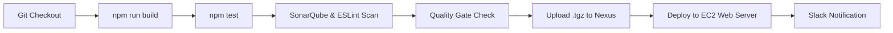
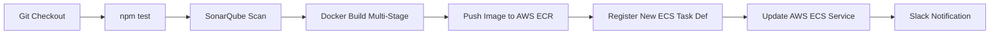

# 📊 Attendance & Salary Management System

[](https://jenkins.io)
[](https://sonarqube.org)
[](https://docker.com)
[](https://aws.amazon.com)

A high-performance **Attendance & Salary Management System** with automated payroll computation, attendance tracking, tax deduction calculation, and employee payslip generation. Built with a modern glassmorphism web interface and fully automated dual **CI/CD Pipelines** (Native Artifact Packaging + Docker Containerization with AWS ECR/ECS).

---

## 🌟 Key Application Features

- **Attendance Tracker**: Log daily employee attendance, days present vs absent, and attendance percentage.
- **Automated Payroll Engine**: Calculates net salary based on base salary, working days present, and 10% tax deduction.
- **Interactive HR Dashboard**: Metrics cards for active employees, present count, leaves, and total monthly payroll.
- **Printable Payslip Statement**: Modal view to inspect individual breakdown and print payslips.
- **Unit Test Coverage**: Automated test suite (`test.js`) verifying payroll calculation edge cases.

---

## 🏗️ Dual CI/CD Architecture Overview

This project includes **two complete enterprise CI/CD implementations**:

### Approach 1: Native Artifact Packaging (Nexus & EC2)
Builds a native `.tgz` archive, runs tests, performs SonarQube SAST analysis, uploads to Sonatype Nexus Repository, and deploys to production web servers.



### Approach 2: Docker Containerization (AWS ECR & ECS)
Packages the app inside a multi-stage Docker container (`Dockerfile`), runs tests & SonarQube, pushes the container image to AWS ECR, and executes a zero-downtime rolling update on AWS ECS by registering a new Task Definition revision.



---

## 📂 Project Repository Structure

```text
attendance-salary-app/
├── index.html              # Glassmorphism Dashboard UI
├── style.css               # Design System Tokens & Modern Typography
├── app.js                  # State Management & Payroll Calculation Engine
├── test.js                 # Automated Salary Calculation Unit Test Suite
├── package.json            # NPM Build & Test Scripts
├── eslint.config.js        # Modern ESLint Flat Configuration File
├── Dockerfile              # Multi-Stage Docker Build File (Node -> Nginx)
├── Jenkinsfile.packaging   # Approach 1 CI/CD Pipeline (Native + Nexus)
└── Jenkinsfile.docker      # Approach 2 CI/CD Pipeline (Docker + ECR + ECS)
```

---

## 🚀 Local Development & Setup

### 1. Run Application Locally
Open `index.html` directly in your browser, or start a local web server:
```bash
npm start
# Server starts at http://localhost:3000
```

### 2. Run Automated Unit Tests
```bash
npm test
```

### 3. Run ESLint Code Analysis
```bash
npx -y eslint -f json -o eslint-report.json .
```

### 4. Build Docker Image Locally
```bash
docker build -t attendance-salary-app:latest .
docker run -d -p 8080:80 attendance-salary-app:latest
```

---

## ⚙️ Jenkins CI/CD Setup & Prerequisites

### Required Jenkins Credentials
- `nexuslogin`: Credentials for Sonatype Nexus Repository.
- `Jenkins_aws_login`: AWS IAM User / Role with permissions for ECR and ECS.

### Required Global Tools
- `Sonar8.0`: SonarQube Scanner CLI tool.
- `Sonar-server`: SonarQube server configuration under Jenkins System settings.

---

## 📊 Pipeline Comparison Matrix

| Pipeline Step | Approach 1 (Jenkinsfile.packaging) | Approach 2 (Jenkinsfile.docker) |
| :--- | :--- | :--- |
| **Packaging Format** | Native Archive (`.tgz`) | Multi-Stage Docker Image |
| **Artifact Repository** | Sonatype Nexus 3 | AWS ECR (Elastic Container Registry) |
| **Deployment Target** | AWS EC2 / Nginx Server | AWS ECS Cluster (Fargate / EC2) |
| **Deployment Mechanism**| SSH / Artifact Pull | Task Definition Revision + Rolling Deployment |
| **Verification** | Archive Integrity Check | `aws ecs wait services-stable` |
